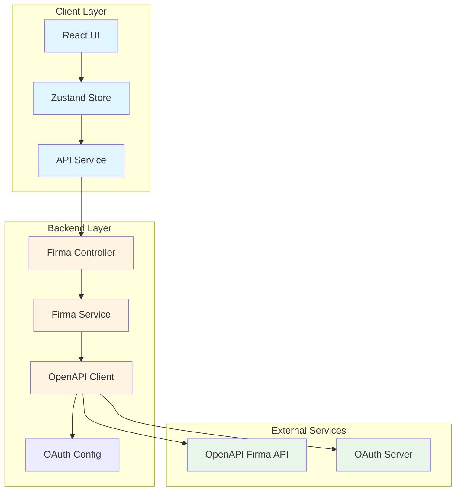
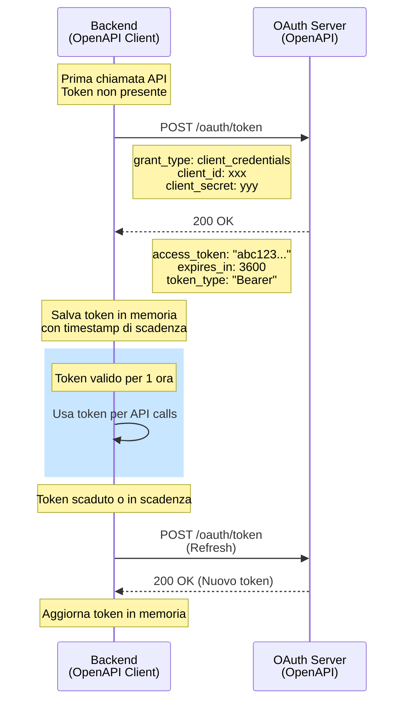
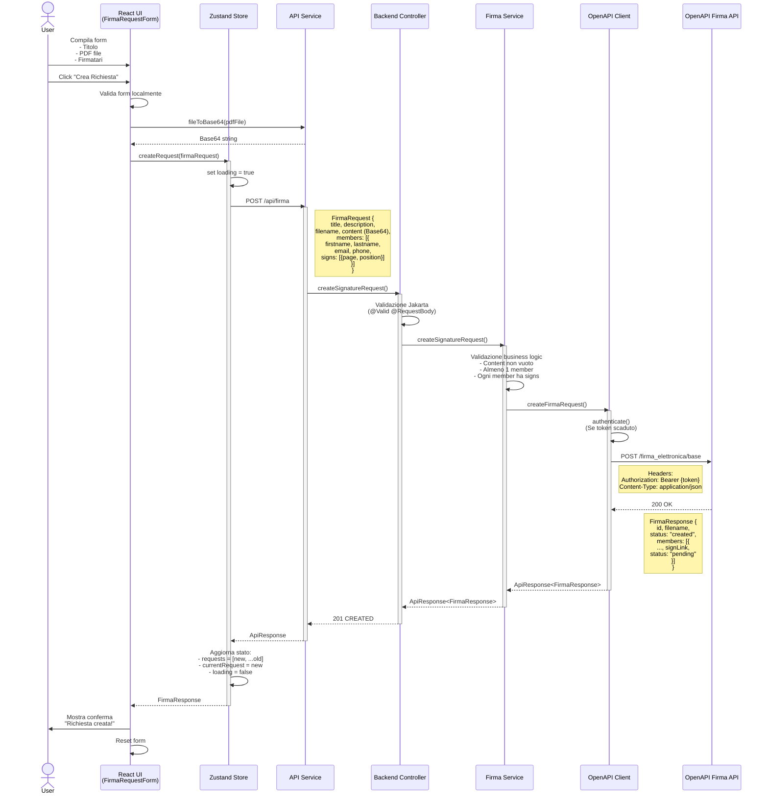
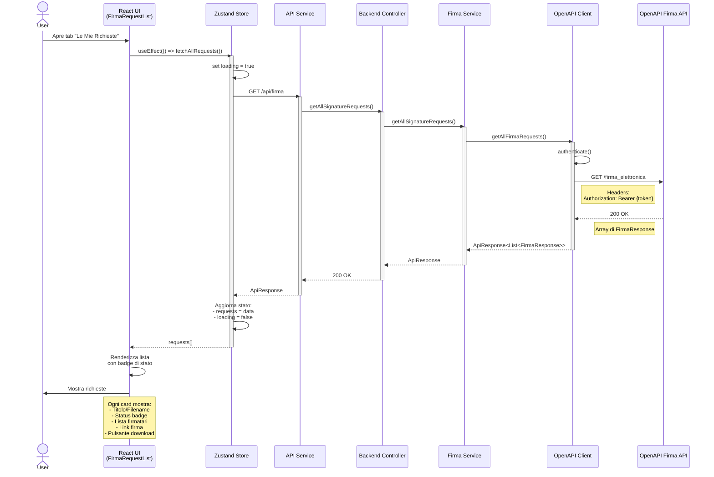
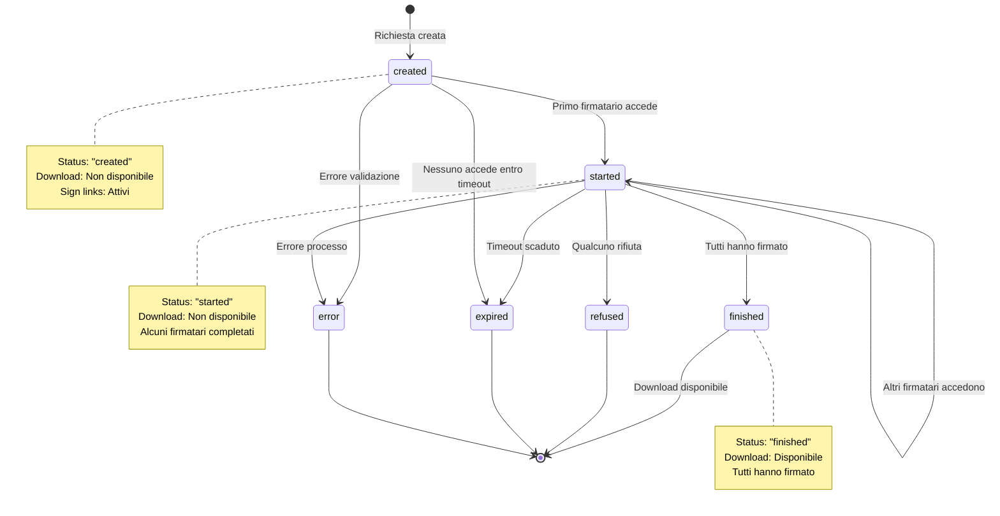
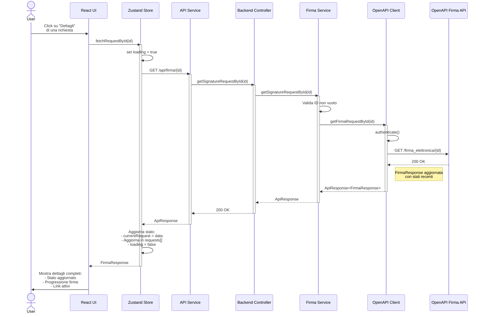
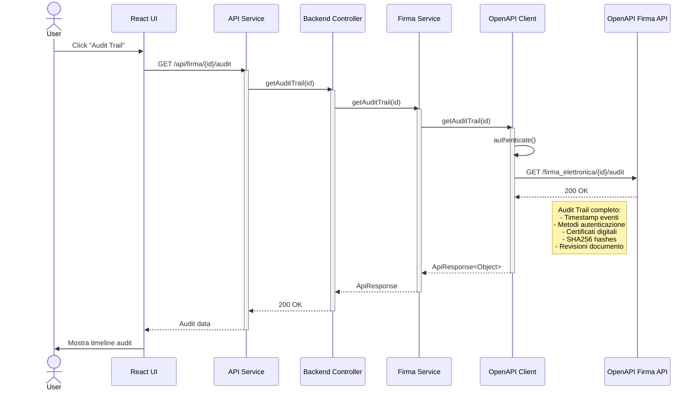
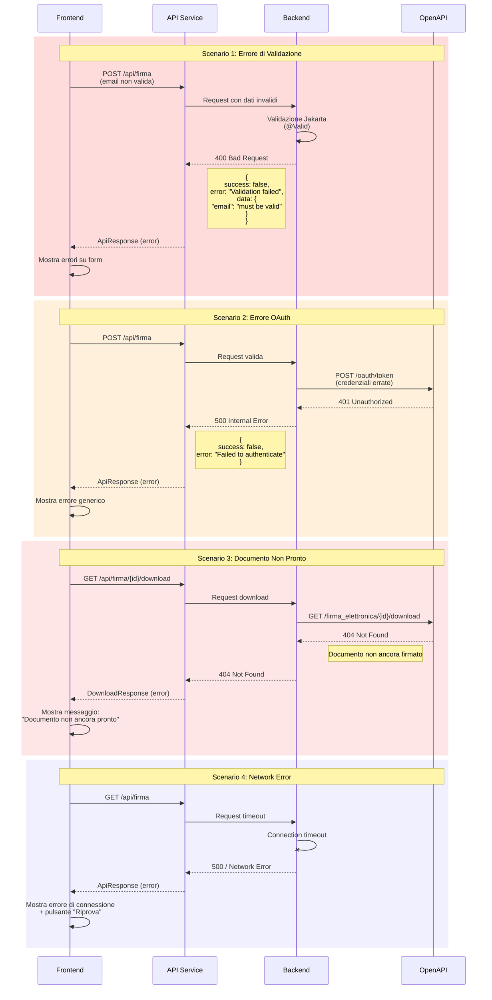
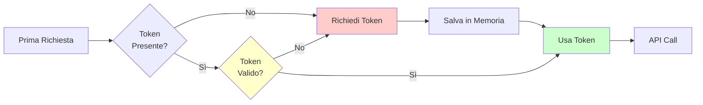
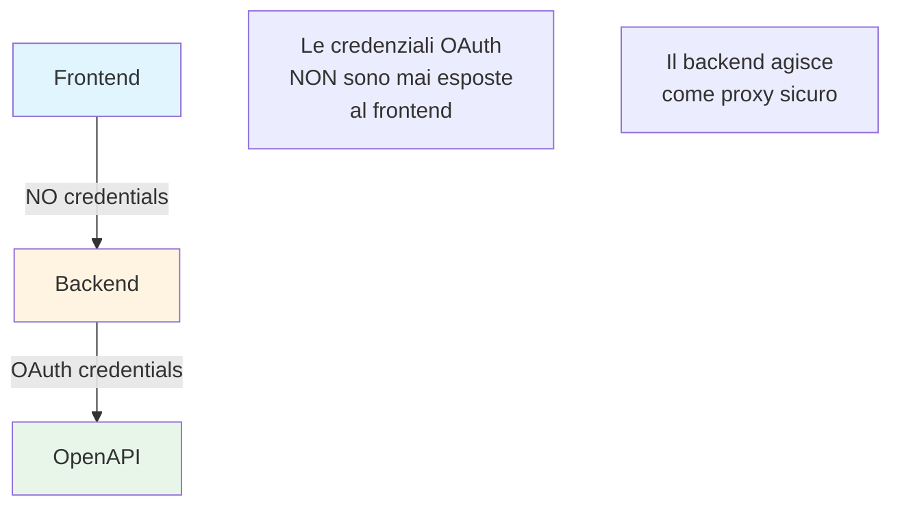

# Flusso di Firma Digitale - Documentazione Tecnica

Questa documentazione descrive i flussi di interazione tra Frontend, Backend e OpenAPI per la gestione delle firme digitali.

## Indice

1. [Architettura Generale](#architettura-generale)
2. [Flusso di Autenticazione OAuth](#flusso-di-autenticazione-oauth)
3. [Creazione Richiesta di Firma](#creazione-richiesta-di-firma)
4. [Recupero Lista Richieste](#recupero-lista-richieste)
5. [Dettagli Richiesta Singola](#dettagli-richiesta-singola)
6. [Download Documento Firmato](#download-documento-firmato)
7. [Recupero Audit Trail](#recupero-audit-trail)
8. [Gestione Errori](#gestione-errori)

---

## Architettura Generale



### Componenti Principali

#### Frontend (React)
- **UI Components**: Form e lista per gestire le richieste
- **Zustand Store**: State management centralizzato
- **API Service**: Client HTTP con Axios

#### Backend (Spring Boot)
- **Controller**: REST endpoints esposti al frontend
- **Service**: Business logic e validazione
- **Client**: Integrazione con OpenAPI
- **Config**: Gestione OAuth e configurazioni

#### OpenAPI
- **Firma API**: Servizi di firma elettronica
- **OAuth Server**: Autenticazione client credentials

---

## Flusso di Autenticazione OAuth



### Dettagli Implementazione

**File**: [OpenApiFirmaClient.java](../backend/src/main/java/com/openapi/firma/client/OpenApiFirmaClient.java)

```java
private void authenticate() {
    // Controlla se il token è ancora valido
    if (accessToken != null && tokenExpiry != null
        && Instant.now().isBefore(tokenExpiry)) {
        return; // Token ancora valido
    }

    // Richiedi nuovo token
    // grant_type: client_credentials
    // client_id e client_secret da configurazione
}
```

**Configurazione**: [application.yml](../backend/src/main/resources/application.yml)

```yaml
openapi:
  firma:
    oauth:
      token-url: https://test.ws.firmadigitale.com/oauth/token
      client-id: ${OPENAPI_CLIENT_ID}
      client-secret: ${OPENAPI_CLIENT_SECRET}
```

---

## Creazione Richiesta di Firma



### Request/Response Schema

**Frontend Request**:
```typescript
interface FirmaRequest {
  title?: string;
  description?: string;
  filename: string;
  content: string; // Base64 PDF
  members: Member[];
}

interface Member {
  firstname: string;
  lastname: string;
  email: string;
  phone: string; // +393331234567
  signs: SignPosition[];
}

interface SignPosition {
  page: number; // starts at 1
  position?: string; // "x1,y1,x2,y2"
}
```

**Backend Response**:
```json
{
  "data": {
    "id": "uuid-123-456",
    "filename": "contratto.pdf",
    "title": "Contratto di lavoro",
    "status": "created",
    "members": [
      {
        "firstname": "Mario",
        "lastname": "Rossi",
        "email": "mario@example.com",
        "phone": "+393331234567",
        "status": "pending",
        "signLink": "https://firma.openapi.com/sign/xxx",
        "createdAt": "2025-01-15T10:00:00",
        "updatedAt": "2025-01-15T10:00:00"
      }
    ]
  },
  "success": true,
  "message": "Richiesta creata con successo"
}
```

---

## Recupero Lista Richieste



### Stati della Richiesta



---

## Dettagli Richiesta Singola



---

## Download Documento Firmato

```mermaid
sequenceDiagram
    actor User
    participant UI as React UI
    participant Store as Zustand Store
    participant API as API Service
    participant Controller as Backend Controller
    participant Service as Firma Service
    participant Client as OpenAPI Client
    participant OpenAPI as OpenAPI Firma API
    participant Browser as Browser

    User->>UI: Click "Scarica PDF Firmato"
    Note over UI: Pulsante visibile solo<br/>se status = "finished"

    UI->>Store: downloadDocument(id, filename)
    activate Store
    Store->>Store: set loading = true

    Store->>API: GET /api/firma/{id}/download
    activate API
    API->>Controller: downloadSignedDocument(id)
    activate Controller
    Controller->>Service: downloadSignedDocument(id)
    activate Service

    Service->>Client: downloadSignedDocument(id)
    activate Client
    Client->>Client: authenticate()
    Client->>OpenAPI: GET /firma_elettronica/{id}/download

    OpenAPI-->>Client: 200 OK
    Note left of OpenAPI: DownloadResponse {<br/>  content: "Base64...",<br/>  success: true<br/>}

    Client-->>Service: DownloadResponse
    deactivate Client
    Service-->>Controller: DownloadResponse
    deactivate Service
    Controller-->>API: 200 OK
    deactivate Controller
    API-->>Store: DownloadResponse
    deactivate API

    Store->>API: downloadBase64AsPdf(content, filename)
    activate API
    API->>API: Crea data URL:<br/>"data:application/pdf;base64,{content}"
    API->>Browser: Trigger download<br/>(createElement('a').click())
    Browser->>User: Salva file PDF
    deactivate API

    Store->>Store: set loading = false
    deactivate Store

    User->>User: Apre PDF firmato
```

### Formato Download Response

```json
{
  "content": "JVBERi0xLjQKJeLjz9MK...(Base64 PDF)",
  "success": true,
  "message": "Document downloaded successfully"
}
```

### Conversione Base64 → PDF

```typescript
// API Service Helper
downloadBase64AsPdf(base64Content: string, filename: string) {
  const linkSource = `data:application/pdf;base64,${base64Content}`;
  const downloadLink = document.createElement('a');
  downloadLink.href = linkSource;
  downloadLink.download = filename;
  downloadLink.click();
}
```

---

## Recupero Audit Trail



### Struttura Audit Trail

```json
{
  "data": {
    "requestId": "uuid-123",
    "events": [
      {
        "timestamp": "2025-01-15T10:00:00Z",
        "event": "Request created",
        "actor": "system"
      },
      {
        "timestamp": "2025-01-15T10:05:00Z",
        "event": "Email sent to signers",
        "details": "2 recipients"
      },
      {
        "timestamp": "2025-01-15T11:30:00Z",
        "event": "Document signed",
        "actor": "Mario Rossi",
        "authMethod": "OTP SMS",
        "certificateId": "cert-456"
      }
    ],
    "documentRevisions": [
      {
        "version": 1,
        "sha256": "abc123...",
        "timestamp": "2025-01-15T10:00:00Z"
      }
    ]
  },
  "success": true
}
```

---

## Gestione Errori



### Codici di Errore HTTP

| Codice | Significato | Gestione Frontend |
|--------|-------------|-------------------|
| 400 | Bad Request - Validazione fallita | Mostra errori specifici sui campi del form |
| 401 | Unauthorized - Token OAuth invalido | Log dell'errore, suggerisci verifica credenziali |
| 404 | Not Found - Risorsa non trovata | Messaggio "Richiesta non trovata" |
| 500 | Internal Server Error | Messaggio errore generico + retry |
| 503 | Service Unavailable | Messaggio "Servizio temporaneamente non disponibile" |

### Error Handling nel Frontend

```typescript
// Zustand Store
createRequest: async (request: FirmaRequest) => {
  set({ loading: true, error: null });
  try {
    const response = await firmaApi.createSignatureRequest(request);

    if (response.success && response.data) {
      // Success path
      set({
        requests: [response.data, ...state.requests],
        currentRequest: response.data,
        loading: false
      });
      return response.data;
    } else {
      // API returned error
      set({
        error: response.error || 'Failed to create request',
        loading: false
      });
      return null;
    }
  } catch (error: any) {
    // Network or unexpected error
    set({
      error: error.message || 'An unexpected error occurred',
      loading: false
    });
    return null;
  }
}
```

### Error Handling nel Backend

```java
@RestControllerAdvice
public class GlobalExceptionHandler {

    @ExceptionHandler(MethodArgumentNotValidException.class)
    public ResponseEntity<ApiResponse> handleValidation(
        MethodArgumentNotValidException ex) {

        Map<String, String> errors = new HashMap<>();
        ex.getBindingResult().getAllErrors().forEach(error -> {
            String field = ((FieldError) error).getField();
            String message = error.getDefaultMessage();
            errors.put(field, message);
        });

        return ResponseEntity.badRequest()
            .body(ApiResponse.builder()
                .success(false)
                .error("Validation failed")
                .data(errors)
                .build());
    }

    @ExceptionHandler(Exception.class)
    public ResponseEntity<ApiResponse> handleGeneric(Exception ex) {
        log.error("Unhandled exception", ex);

        return ResponseEntity.status(500)
            .body(ApiResponse.builder()
                .success(false)
                .error("An unexpected error occurred")
                .build());
    }
}
```

---

## Riepilogo Endpoint

### Frontend → Backend

| Metodo | Endpoint | Descrizione |
|--------|----------|-------------|
| POST | `/api/firma` | Crea nuova richiesta di firma |
| GET | `/api/firma` | Lista tutte le richieste |
| GET | `/api/firma/{id}` | Dettagli richiesta specifica |
| GET | `/api/firma/{id}/download` | Scarica documento firmato |
| GET | `/api/firma/{id}/audit` | Recupera audit trail |
| GET | `/api/firma/health` | Health check |

### Backend → OpenAPI

| Metodo | Endpoint | Descrizione |
|--------|----------|-------------|
| POST | `/oauth/token` | Ottieni token OAuth |
| POST | `/firma_elettronica/base` | Crea richiesta firma |
| GET | `/firma_elettronica` | Lista richieste |
| GET | `/firma_elettronica/{id}` | Dettagli richiesta |
| GET | `/firma_elettronica/{id}/download` | Scarica PDF firmato |
| GET | `/firma_elettronica/{id}/audit` | Audit trail |

---

## Performance e Ottimizzazioni

### Caching del Token OAuth



**Implementazione**: Il token viene salvato in memoria con timestamp di scadenza. Viene richiesto solo quando scade.

### Rate Limiting

OpenAPI ha un limite di **10,000 richieste/minuto**.

**Raccomandazioni**:
- Implementare debouncing sui pulsanti di refresh
- Cache client-side per liste recenti
- Polling intelligente con backoff esponenziale

### Ottimizzazioni Frontend

1. **Lazy Loading**: Carica lista richieste solo quando necessario
2. **Debouncing**: Sui pulsanti di refresh (min 1 secondo)
3. **Virtualization**: Per liste molto lunghe
4. **Memoization**: React.memo per componenti pesanti

---

## Note di Sicurezza

### Separazione delle Credenziali



### Best Practices

1. **Mai esporre credenziali OAuth nel frontend**
2. **Usare HTTPS in produzione**
3. **Validare sempre input lato server**
4. **Sanitizzare file PDF prima dell'upload**
5. **Implementare CORS restrittivo**
6. **Loggare tentativi di accesso non autorizzato**

---

## Riferimenti

- [OpenAPI Documentation](https://console.openapi.com/apis/firma/documentation)
- [CLAUDE.md](../CLAUDE.md) - Guida per sviluppatori
- [SETUP.md](../SETUP.md) - Istruzioni di setup
- [TROUBLESHOOTING.md](../TROUBLESHOOTING.md) - Risoluzione problemi
